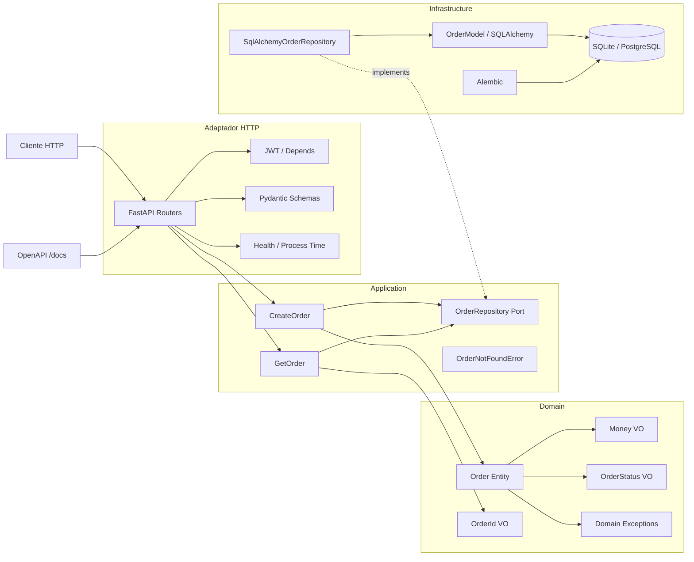
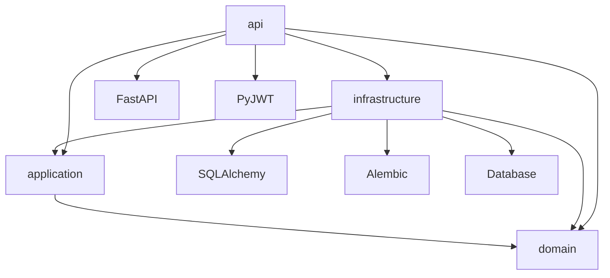

# Orders Service

Proyecto Final Integrador implementado con Arquitectura Hexagonal / Clean
Architecture en Python. El sistema expone una API HTTP con FastAPI para crear y
consultar ordenes, mantiene el dominio desacoplado de frameworks, usa
SQLAlchemy 2.0 como adaptador de persistencia, Alembic para migraciones y JWT
para autenticacion.

Estado actual del proyecto:

- Arquitectura hexagonal implementada en capas `domain`, `application`,
  `infrastructure` y `api`
- Dominio aislado de FastAPI, SQLAlchemy y Pydantic
- Casos de uso desacoplados mediante puertos
- Persistencia configurable por entorno
- Seguridad con `pydantic-settings`, JWT, auditoria de dependencias y Docker
  no-root
- Observabilidad minima con `GET /health` y header `X-Process-Time`
- Cobertura automatica alta y pipeline CI funcional

## Objetivo

El proyecto demuestra como modelar un servicio backend profesional con foco en:

- separacion estricta de responsabilidades
- reglas de negocio encapsuladas en el dominio
- inversion de dependencias
- adaptadores intercambiables
- seguridad y mantenibilidad operativa

## Arquitectura Hexagonal

La arquitectura se organiza alrededor del dominio. Las dependencias apuntan
siempre hacia adentro:

- `domain`: reglas de negocio puras
- `application`: casos de uso y puertos
- `infrastructure`: adaptadores tecnicos
- `api`: adaptador HTTP

### Diagrama Hexagonal



### Diagrama de Dependencias



## Estructura del Proyecto

```text
src/orders_service/
  api/
    routers/
      auth.py
      orders.py
    schemas/
      orders.py
    dependencies.py
    main.py
    security.py
  application/
    ports/
      order_repository.py
    use_cases/
      create_order.py
      get_order.py
    exceptions.py
  domain/
    entities/
      order.py
    value_objects/
      money.py
      order_id.py
      order_status.py
    exceptions/
      domain_exceptions.py
  infrastructure/
    database/
      base.py
      models.py
      session.py
    repositories/
      sqlalchemy_order_repository.py

alembic/
tests/
Dockerfile
docker-compose.yml
pyproject.toml
```

## Capas

### Domain

Responsable de modelar la logica central:

- entidad `Order`
- value objects `OrderId`, `Money`, `OrderStatus`
- excepciones de dominio
- invariantes y transiciones de estado

No depende de frameworks ni librerias de infraestructura.

### Application

Responsable de orquestar casos de uso:

- `CreateOrder`
- `GetOrder`
- puerto `OrderRepository`
- excepcion `OrderNotFoundError`

Depende del dominio y de contratos abstractos, no de implementaciones concretas.

### Infrastructure

Responsable de adaptadores tecnicos:

- `SqlAlchemyOrderRepository`
- configuracion de sesion SQLAlchemy
- modelos ORM
- migraciones Alembic

Implementa los puertos definidos en application.

### API

Responsable de exponer el sistema como HTTP:

- FastAPI
- routers desacoplados
- DTOs Pydantic
- autenticacion JWT
- traduccion de errores a codigos HTTP

## Principios Arquitectonicos Aplicados

### Dependency Inversion Principle

Los casos de uso no dependen de `SqlAlchemyOrderRepository`, sino de
`OrderRepository`. Esto permite:

- cambiar SQLite por PostgreSQL sin tocar casos de uso
- usar un repositorio en memoria en pruebas
- mantener application desacoplada de infraestructura

### Aislamiento del Dominio

El dominio:

- no importa FastAPI
- no importa SQLAlchemy
- no importa Pydantic
- no contiene logica de persistencia

Esto permite probar reglas de negocio en forma unitaria y mantener estabilidad
frente a cambios tecnologicos.

### Adaptadores Intercambiables

El puerto `OrderRepository` es implementado por:

- fake/in-memory repository en pruebas de application
- `SqlAlchemyOrderRepository` en infraestructura

La misma API de casos de uso opera con cualquiera de las dos implementaciones.

## Variables de Entorno

La configuracion usa `pydantic-settings`.

| Variable | Obligatoria | Descripcion |
|---|---:|---|
| `SECRET_KEY` | Si | Clave para firmar JWT, minimo 32 caracteres |
| `ALGORITHM` | No | Algoritmo JWT, por defecto `HS256` |
| `ACCESS_TOKEN_EXPIRE_MINUTES` | No | Tiempo de expiracion del token |
| `DATABASE_URL` | No | Conexion SQLAlchemy, por defecto `sqlite:///./orders.db` |
| `DB_ECHO` | No | Activa logs SQL |
| `AUTH_USERNAME` | Si | Usuario valido para login |
| `AUTH_PASSWORD_HASH` | Si | Hash bcrypt de la contrasena |

Ejemplo de `.env`:

```env
SECRET_KEY=replace-with-a-long-secret-key-of-at-least-32-characters
ALGORITHM=HS256
ACCESS_TOKEN_EXPIRE_MINUTES=30
DATABASE_URL=sqlite:///./orders.db
DB_ECHO=false
AUTH_USERNAME=admin
AUTH_PASSWORD_HASH=$2b$12$replace.this.with.a.real.bcrypt.hash
```

Generar hash bcrypt:

```powershell
@'
import bcrypt

password = "change-this-password".encode("utf-8")
print(bcrypt.hashpw(password, bcrypt.gensalt()).decode("utf-8"))
'@ | .\.venv\Scripts\python.exe -
```

## Ejecucion Local

### 1. Crear entorno

```powershell
poetry install
```

Si trabajas con `.venv` local:

```powershell
.\.venv\Scripts\python.exe -m pip install --upgrade pip
```

### 2. Configurar entorno

```powershell
Copy-Item .env.example .env
```

Edita `.env` con tus valores reales.

### 3. Aplicar migraciones

```powershell
.\.venv\Scripts\python.exe -m alembic upgrade head
```

### 4. Levantar la API

```powershell
.\.venv\Scripts\python.exe -m uvicorn orders_service.api.main:app --reload
```

Endpoints principales:

- `POST /auth/login`
- `POST /orders/`
- `GET /orders/{order_id}`
- `GET /health`
- `GET /docs`

## Ejecucion con Docker

Build:

```powershell
docker build -t orders-service .
```

Run:

```powershell
docker run --rm -p 8000:8000 --env-file .env orders-service
```

O con Compose:

```powershell
docker compose up --build
```

Caracteristicas del contenedor:

- imagen multistage
- runtime basado en `python:3.12-slim`
- usuario no-root
- shell bloqueada para usuario de aplicacion
- permisos minimos sobre `/app`
- solo dependencias runtime en produccion
- migraciones Alembic al arrancar

## Testing y Calidad

Suite de pruebas:

```powershell
.\.venv\Scripts\python.exe -m pytest -q
```

Cobertura:

```powershell
.\.venv\Scripts\python.exe -m pytest --cov=orders_service --cov-report=term-missing --cov-fail-under=85
```

Lint:

```powershell
.\.venv\Scripts\ruff check .
.\.venv\Scripts\black --check .
.\.venv\Scripts\python.exe -m mypy src
```

Estado actual de calidad:

- 30 tests
- cobertura mayor al 98%
- `ruff` limpio
- `black` limpio
- `mypy` limpio

## Seguridad y Auditoria

Medidas implementadas:

- `SECRET_KEY` obligatoria
- `AUTH_PASSWORD_HASH` obligatoria
- validacion de longitud minima para `SECRET_KEY`
- validacion de hash bcrypt valido
- JWT con expiracion
- manejo robusto de `401`, `404` y `422`
- contenedor no-root
- permisos minimos en runtime

Auditoria de dependencias:

```powershell
.\.venv\Scripts\python.exe scripts/export_runtime_requirements.py --output .audit/runtime-requirements.txt
.\.venv\Scripts\pip-audit --requirement .audit/runtime-requirements.txt --no-deps
.\.venv\Scripts\safety check
```

CI:

- instala dependencias
- ejecuta lint
- ejecuta format check
- ejecuta type check
- ejecuta tests con cobertura
- exporta dependencias runtime desde `poetry.lock`
- ejecuta `pip-audit` sobre dependencias runtime
- ejecuta `safety`

## Observabilidad y Rendimiento

Medidas implementadas:

- endpoint `GET /health` para healthcheck operativo
- middleware HTTP que agrega `X-Process-Time` en cada respuesta
- controladores delgados que delegan en casos de uso y minimizan logica en capa
  API
- persistencia desacoplada, lo que permite cambiar infraestructura sin afectar
  el rendimiento del dominio

Estas medidas no reemplazan monitoreo enterprise, pero si dejan evidencia
concreta de observabilidad minima y permiten evolucionar a logging estructurado,
metrics o tracing sin romper capas.

## Checklist contra Rubrica

### Arquitectura

- [x] Capas separadas: domain, application, infrastructure, api
- [x] Dominio desacoplado de frameworks
- [x] Puertos y adaptadores definidos
- [x] Inversion de dependencias aplicada
- [x] Adaptadores intercambiables

### Dominio

- [x] Entidad `Order`
- [x] Value Objects `OrderId`, `Money`, `OrderStatus`
- [x] Excepciones de dominio
- [x] Tipado estatico correcto
- [x] Reglas de negocio encapsuladas

### Application

- [x] Casos de uso `CreateOrder` y `GetOrder`
- [x] Puerto `OrderRepository`
- [x] Error de aplicacion `OrderNotFoundError`
- [x] Sin dependencia de FastAPI o SQLAlchemy

### Infrastructure

- [x] SQLAlchemy 2.0
- [x] Repositorio SQLAlchemy
- [x] Migracion Alembic inicial real
- [x] Conversion UUID / Decimal / datetime
- [x] Base de datos configurable por entorno

### API

- [x] FastAPI operativo
- [x] Routers desacoplados
- [x] JWT con expiracion
- [x] Validacion automatica 422
- [x] Manejo correcto 401 / 404
- [x] OpenAPI funcional

### Seguridad

- [x] `SECRET_KEY` obligatoria
- [x] Sin secretos hardcodeados en codigo
- [x] `pydantic-settings`
- [x] `pip-audit` limpio
- [x] `safety` limpio
- [x] Docker no-root
- [x] Permisos minimos

### Calidad

- [x] Cobertura alta
- [x] Tests unitarios e integracion
- [x] `ruff` limpio
- [x] `black` limpio
- [x] `mypy` limpio
- [x] CI funcional
- [x] Docker multistage

### Observabilidad y Rendimiento

- [x] Endpoint `GET /health`
- [x] Header `X-Process-Time` por request
- [x] Controladores HTTP delgados
- [x] Base apta para evolucionar a logging, metrics o tracing

## Defensa Tecnica

### Como se aplica DIP

`application` depende del puerto `OrderRepository`, no de `SqlAlchemyOrderRepository`.
Esto cumple DIP porque la politica de negocio depende de una abstraccion y no de
un detalle tecnico.

### Como se garantiza el aislamiento del dominio

El dominio solo contiene:

- entidades
- value objects
- excepciones
- reglas de negocio

No conoce HTTP, ORM, Pydantic ni mecanismos de almacenamiento.

### Decisiones arquitectonicas relevantes

1. Elegir puertos en application para desacoplar use cases de infraestructura.
2. Mantener el dominio puro para proteger las reglas de negocio.
3. Usar FastAPI solo como adaptador HTTP y no como centro de la arquitectura.
4. Usar Alembic para evolucion de esquema controlada.
5. Usar pruebas en dominio, application, api e integracion para cubrir los
   distintos niveles.

### Estrategia de seguridad

- configuracion por entorno con `pydantic-settings`
- secretos fuera del codigo
- hash bcrypt para autenticacion
- expiracion de tokens JWT
- validacion robusta de token y credenciales
- auditoria automatica de dependencias
- contenedor no-root

### Estrategia de mantenimiento

- revisar dependencias por sprint
- actualizar lockfile de forma controlada
- ejecutar auditorias antes de aceptar cambios
- usar CI como gate de calidad
- regenerar imagen Docker tras cambios de dependencias o seguridad

## Version Lista para v1.0.0

El proyecto queda listo para etiquetarse como `v1.0.0` porque:

- la arquitectura esta cerrada
- la funcionalidad principal esta implementada
- la seguridad base esta resuelta
- la observabilidad minima ya esta implementada
- la cobertura automatica es alta
- el pipeline de calidad es reproducible
- Docker y CI estan operativos

Ademas, el paquete ya se encuentra versionado como `1.0.0` en
`pyproject.toml`.

Comandos sugeridos para cierre de version:

```powershell
git status
git add .
git commit -m "release: finalize v1.0.0"
git tag v1.0.0
git push origin main --tags
```

## Comandos Rapidos

```powershell
.\.venv\Scripts\ruff check .
.\.venv\Scripts\black --check .
.\.venv\Scripts\python.exe -m pytest --cov=orders_service --cov-report=term-missing --cov-fail-under=85
.\.venv\Scripts\python.exe -m mypy src
.\.venv\Scripts\python.exe scripts/export_runtime_requirements.py --output .audit/runtime-requirements.txt
.\.venv\Scripts\pip-audit --requirement .audit/runtime-requirements.txt --no-deps
.\.venv\Scripts\safety check
docker build -t orders-service .
docker run --rm -p 8000:8000 --env-file .env orders-service
```
